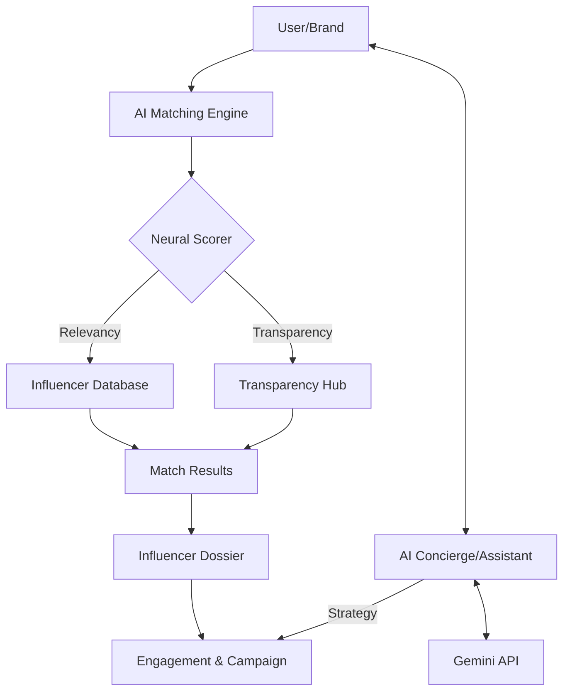

# InfluMatch Platform Workflow

This document outlines the core operational flow of the InfluMatch platform, from initial discovery to neural strategy optimization.

## 1. High-Level System Architecture

## 2. Core Operational Workflows

### A. The Discovery Workflow (AI Matching)
1. **Input**: User enters a natural language goal (e.g., *"Fitness creators in Hyderabad for a resort promotion"*).
2. **Processing**: The **Neural Engine v4.5** tokenizes the query.
3. **Scoring**:
   - **Niche Alignment**: +10 points for exact match.
   - **Geographic Proximity**: +8 points for city match.
   - **Contextual Bio**: +2 points for keyword inclusion.
4. **Transparency Check**: Real-time cross-referencing with the **Transparency Hub** for engagement quality.
5. **Output**: Top 4 matches with "Match Scores" and "Transparency Index".

### B. The Trust Workflow (Transparency Hub)
1. **Source Discovery**: Aggregates verified news articles and audit reports.
2. **Neural Ranking**: Matches articles based on the creator's current market footprint.
3. **Safety Scan**: Runs a compliance check against brand safety standards.
4. **Visibility**: Displayed directly on match cards to build instant credibility between brand and creator.

### C. The Strategy Workflow (AI Assistant)
1. **Prompt Entry**: User asks general or specific strategic questions.
2. **Hybrid Logic Routing**:
   - **Tactical**: If internal (e.g., *"Show matches"*), routes to local navigation.
   - **Neural**: If complex (e.g., *"What are the trends for 2026?"*), invokes **Gemini 1.5 Flash**.
3. **Insight Generation**: Delivers data-backed reports on regions, pricing, and attribution.
4. **Automation**: Generates clickable links and campaign blueprints.

## 3. Data Entities

| Entity | Role | Key Data Points |
| :--- | :--- | :--- |
| **Influencer** | Core Asset | Audience DNA, Niche, City, Engagement Rate |
| **NewsArticle** | Trust Build | Title, Source, URL, Date |
| **Neural Score** | Match Logic | Relevancy %, Credibility %, Compliance Status |
| **Assistant Session**| Context | AES-256 Encrypted Chat History, Gemini Insights |

---
*Created by Antigravity AI Engine*
